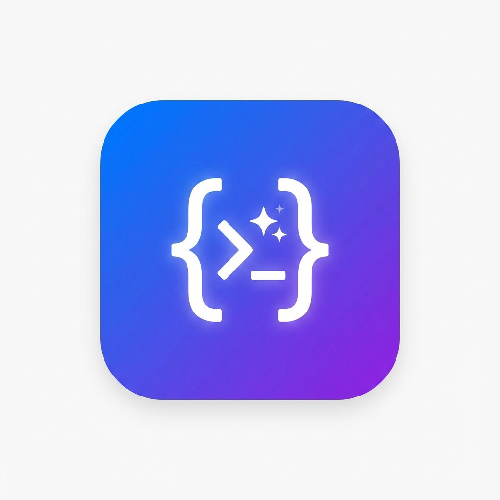

# Jules Mobile Client

<p align="center">
  
</p>

<p align="center">
  <strong>A React Native mobile client for Google's Jules AI coding assistant</strong>
</p>

<p align="center">
  <a href="README.ja.md">🇯🇵 日本語</a> •
  <a href="docs/ARCHITECTURE.md">📐 Architecture</a> •
  <a href="docs/API.md">🔌 API Reference</a> •
  <a href="docs/Agent.md">🤖 Agent Guide</a> •
  <a href="docs/Github-Integration.md">🍎 GitHub Integration</a> •
  <a href="docs/USER-GUIDE.md">📖 User Guide</a> •
  <a href="docs/DEVELOPER-GUIDE.md">💻 Developer Guide</a>
</p>

---

## ✨ Features

- 📱 **Cross-Platform** - Works on iOS and Android via Expo
- 🌙 **Dark Mode** - Full dark/light theme support
- 🌐 **i18n** - Japanese and English localization
- 🔐 **Secure Storage** - API keys stored securely with expo-secure-store
- 💬 **Real-time Chat** - View and interact with Jules sessions
- 📝 **Markdown Support** - Rich text rendering with syntax highlighting
- ⚡ **Optimized Performance** - Memoized components and efficient list rendering
- 🍎 **GitHub Integration** - Complete GitHub repository management and monitoring
- 🔄 **Repository Sync** - Automatic synchronization with intelligent caching
- 📋 **Pull Request Analysis** - AI-powered code review and analysis
- 🔔 **Notifications** - Real-time alerts for repository events and workflow status

## 📸 Screenshots

<p align="center">
  
  
  
</p>

|         Sessions         |        New Task         |            Settings             |
| :----------------------: | :---------------------: | :-----------------------------: |
| View all active sessions | Create new coding tasks | Configure API key & preferences |

## 🍎 GitHub Integration

The Jules Mobile Client now includes comprehensive GitHub integration features:

### 🔄 Repository Synchronization

- **Automatic Sync**: Background synchronization with configurable intervals
- **Smart Caching**: Intelligent cache invalidation and management
- **Offline Support**: Full functionality without internet connection
- **Conflict Resolution**: Automatic handling of local vs remote changes

### 📋 Pull Request Analysis

- **AI-Powered Review**: Intelligent code review and analysis using Jules AI
- **Automated Reviews**: Automatic PR review generation with actionable feedback
- **Metrics Calculation**: Comprehensive PR metrics including complexity scoring
- **Review Workflow**: Full integration with GitHub review and approval workflows

### 🔔 Notifications System

- **Real-time Alerts**: Push notifications for repository events and workflow status
- **Customizable Preferences**: User-configurable notification settings and filtering
- **Event Types**: Support for workflow, PR, repository, comment, and mention events
- **Smart Filtering**: Quiet hours support and intelligent notification filtering

### 🚀 Workflow Management

- **Workflow Monitoring**: Real-time monitoring of GitHub Actions workflows
- **Run History**: Complete workflow run history and detailed logs
- **Status Updates**: Real-time status changes and notifications
- **Log Viewing**: Access to detailed workflow execution logs

### 🔗 Deep Linking

- **URL-based Sessions**: Create sessions directly from GitHub URLs
- **Repository Context**: Sessions include repository metadata and context
- **Branch Selection**: Choose specific branches for coding sessions
- **Smart Templates**: Repository-specific prompt templates

For detailed information about GitHub integration, see [GitHub Integration Guide](docs/Github-Integration.md).

## 🚀 Getting Started

### Prerequisites

- [Bun](https://bun.sh/) (recommended JavaScript runtime)
- [Node.js](https://nodejs.org/) 18+ (alternative)
- [Expo CLI](https://docs.expo.dev/get-started/installation/)
- [Jules API Key](https://console.cloud.google.com/) from Google Cloud Console

### Installation

```bash
# Clone the repository
git clone https://github.com/Involvex/jules-mobile-client.git
cd jules-mobile-client

# Install dependencies (using bun - recommended)
bun install

# Or install Expo-specific packages
bunx expo install <package-name>

# Start the development server
bun start
```

### Running on Device

```bash
# iOS Simulator
bun ios

# Android Emulator
bun android

# Web Browser
bun web
```

### Bun Commands Quick Reference

```bash
# Development
bun start          # Start Expo dev server
bun ios            # Run on iOS simulator
bun android        # Run on Android emulator
bun web            # Run in browser

# Package management
bun install        # Install all dependencies
bun add <pkg>      # Add a new package
bunx expo install <pkg>  # Add Expo-compatible package version

# Other
bun lint           # Run ESLint
bun reset-project  # Reset to clean state
```

## ⚙️ Configuration

### API Key Setup

1. Open the app
2. Navigate to **Settings** tab
3. Enter your Jules API Key
4. The key is securely stored on your device

> 💡 Get your API key from [Google Cloud Console](https://console.cloud.google.com/) or Jules Settings page.

## 📂 Project Structure

```
jules-mobile-client/
├── app/                          # Expo Router screens
│   ├── (tabs)/                  # Tab navigation screens
│   │   ├── index.tsx            # Sessions list
│   │   ├── repos.tsx            # GitHub repositories
│   │   └── settings.tsx         # Settings screen
│   ├── session/                 # Session management
│   │   └── [id].tsx             # Session detail/chat
│   ├── create-session.tsx       # New task creation
│   ├── licenses.tsx             # License information
│   ├── modal.tsx                # Modal components
│   └── _layout.tsx              # Root layout
├── components/
│   ├── github/                  # GitHub integration components
│   │   ├── enhanced-repository-manager.tsx
│   │   ├── github-session-creator.tsx
│   │   ├── github-url-handler.tsx
│   │   ├── notifications-center.tsx
│   │   ├── optimized-workflow-dashboard.tsx
│   │   ├── pull-request-analyzer.tsx
│   │   ├── repository-sync-manager.tsx
│   │   ├── webhook-management.tsx
│   │   ├── workflow-card.tsx
│   │   ├── workflow-dashboard.tsx
│   │   ├── workflow-job-card.tsx
│   │   ├── workflow-run-card.tsx
│   │   ├── workflow-run-details.tsx
│   │   ├── workflow-logs-viewer.tsx
│   │   └── workflow-notifications.tsx
│   ├── jules/                   # Jules-specific components
│   │   ├── activity-item.tsx    # Chat bubbles + ActivityItemSkeleton
│   │   ├── session-card.tsx     # Session cards + SessionCardSkeleton
│   │   ├── loading-overlay.tsx
│   │   ├── code-block.tsx       # Syntax highlighted code
│   │   └── data-renderer.tsx    # Data visualization
│   └── ui/                      # Generic UI components
│       ├── collapsible.tsx
│       ├── icon-symbol.ios.tsx
│       ├── icon-symbol.tsx
│       └── optimized-list.tsx
├── constants/
│   ├── api-key-context.tsx      # API key management
│   ├── github-context.tsx       # GitHub integration context
│   ├── i18n-context.tsx         # Internationalization context
│   ├── i18n.ts                  # Translations
│   ├── theme-enhanced.ts        # Enhanced theming
│   ├── theme.ts                 # Color schemes
│   └── types.ts                 # TypeScript types
├── credentials/
│   └── android/                 # Android credentials
├── docs/                        # Documentation
├── hooks/
│   ├── use-color-scheme.ts
│   ├── use-color-scheme.web.ts
│   ├── use-github-api.ts        # GitHub API integration
│   ├── use-github-deep-linking.ts
│   ├── use-github-service.ts
│   ├── use-github-session.ts
│   ├── use-github-webhooks-native.ts
│   ├── use-github-webhooks.ts
│   ├── use-jules-api.ts         # Jules API hook
│   ├── use-notifications.ts
│   ├── use-pull-request-analysis.ts
│   ├── use-repository-manager.ts
│   ├── use-repository-sync.ts
│   ├── use-secure-storage.ts
│   ├── use-theme-color.ts
│   └── use-workflow-updates.ts
├── services/
│   └── github.ts                # GitHub service layer
├── utils/
│   ├── enhanced-cache.ts
│   └── performance.ts
├── __tests__/                   # Test suite
│   ├── accessibility.test.tsx
│   ├── e2e.test.tsx
│   ├── github-integration.test.ts
│   ├── github-repos-integration.test.tsx
│   ├── github-webhooks-native.test.ts
│   ├── notifications.test.ts
│   ├── performance.test.ts
│   ├── pull-request-analysis.test.ts
│   ├── repository-sync.test.ts
│   ├── security.test.ts
│   └── workflow-integration.test.ts
└── assets/                      # Static assets
```

## 🔌 Jules API Integration

The app integrates with the [Jules API](https://jules.googleapis.com/v1alpha) to:

- **List Sessions** - View all coding sessions
- **Create Sessions** - Start new tasks with repository context
- **View Activities** - Real-time chat history with polling
- **Approve Plans** - Confirm AI-generated plans

See [API Reference](docs/API.md) for detailed documentation.

## 🛠️ Tech Stack

| Technology                                                                                | Purpose                |
| ----------------------------------------------------------------------------------------- | ---------------------- |
| [Expo SDK 54](https://expo.dev/)                                                          | React Native framework |
| [Expo Router](https://docs.expo.dev/router/introduction/)                                 | File-based routing     |
| [React Native 0.81](https://reactnative.dev/)                                             | Mobile UI framework    |
| [TypeScript](https://www.typescriptlang.org/)                                             | Type safety            |
| [expo-secure-store](https://docs.expo.dev/versions/latest/sdk/securestore/)               | Secure storage         |
| [react-native-markdown-display](https://github.com/iamacup/react-native-markdown-display) | Markdown rendering     |

## 📱 Building for Production

### Using EAS Build

```bash
# Install EAS CLI
npm install -g eas-cli

# Login to Expo
eas login

# Build for Android (APK)
eas build --platform android --profile production

# Build for iOS
eas build --platform ios --profile production
```

### Build Profiles

| Profile       | Description                       |
| ------------- | --------------------------------- |
| `development` | Development client with debugging |
| `preview`     | Internal distribution APK         |
| `production`  | Production-ready build            |

## 🤝 Contributing

Contributions are welcome! Please read our contributing guidelines before submitting a PR.

### Development Workflow

1. **Fork the repository** on GitHub to your account
2. **Clone your fork** locally:
   ```bash
   git clone https://github.com/YOUR_USERNAME/jules-mobile-client.git
   cd jules-mobile-client
   ```
3. **Set up upstream remote** to stay updated with the main repository:
   ```bash
   git remote add upstream https://github.com/Involvex/jules-mobile-client.git
   ```
4. **Create a feature branch** for your changes:
   ```bash
   git checkout -b feature/your-feature-name
   # or for bug fixes
   git checkout -b fix/issue-description
   ```
5. **Make your changes** and ensure they follow the project's coding standards
6. **Run tests** to verify your changes:
   ```bash
   bun test
   ```
7. **Commit your changes** with descriptive messages:
   ```bash
   git add .
   git commit -m "Add: brief description of your feature"
   ```
8. **Push to your fork**:
   ```bash
   git push origin feature/your-feature-name
   ```
9. **Create a Pull Request** to the main repository (`Involvex/jules-mobile-client`)

### Staying Updated

To keep your fork in sync with the upstream repository:

```bash
# Fetch upstream changes
git fetch upstream

# Merge upstream changes into your main branch
git checkout main
git merge upstream/main

# Push updates to your fork
git push origin main
```

### Code Quality

- Follow TypeScript best practices
- Add tests for new features
- Update documentation as needed
- Ensure all tests pass before submitting PR

## 📄 License

This project is licensed under the BSD 2-Clause License - see the [LICENSE](LICENSE) file for details.

## 🙏 Acknowledgments

- [Google Jules](https://jules.google/) - AI coding assistant
- [Expo](https://expo.dev/) - Amazing React Native tooling
- [React Native](https://reactnative.dev/) - Mobile framework

---

## Support the Project

If you find this project helpful, consider supporting its development! You can sponsor the maintainer through various platforms:

- **GitHub Sponsors**: [Sponsor Involvex](https://github.com/sponsors/involvex)
- **Buy Me a Coffee**: [Support on Buy Me a Coffee](https://buymeacoffee.com/involvex)
- **PayPal**: [Donate via PayPal](https://paypal.me/involvex)
- **Bing Rewards**: [Earn and donate points](https://rewards.bing.com/welcome?rh=14525F68&ref=rafsrchae&form=ML2XE3&OCID=ML2XE3&PUBL=RewardsDO&CREA=ML2XE3)

For more funding options, see our [FUNDING.yml](.github/FUNDING.yml) file.

---

<p align="center">
  Made with ❤️ by <a href="https://github.com/Involvex">Involvex</a>
</p>
