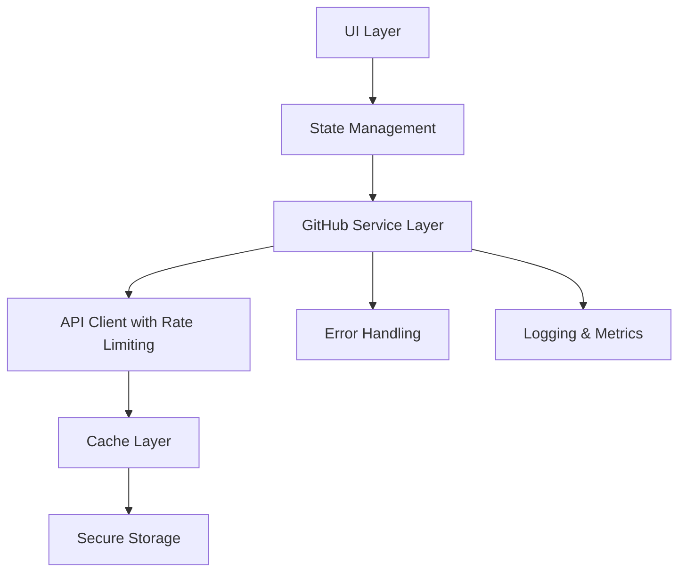

# GitHub Repositories Enhancement Plan

## Current Issues Analysis

### Root Causes of Excessive API Calls

1. **No Rate Limiting**: Current implementation lacks proper rate limit detection and handling
2. **Inefficient Polling**: Background sync runs every 5 minutes without considering rate limits
3. **No Caching Strategy**: While there's basic caching, it doesn't implement stale-while-revalidate
4. **No Retry Logic**: Failed requests aren't retried with exponential backoff
5. **No Request Batching**: Individual API calls for each repository detail

### Performance Bottlenecks

1. **Unoptimized Lists**: No virtualization for large repository lists
2. **No Debouncing**: Search and filter operations trigger immediate API calls
3. **No Pagination**: All repositories loaded at once
4. **No Memoization**: Components re-render unnecessarily

## New Architecture Design

### System Architecture Diagram



### Component Responsibilities

#### 1. GitHub Service Layer (`@/services/github.ts`)

- **Responsibilities**:
  - Centralized API client with Octokit
  - Rate limit detection and handling
  - Request retry with exponential backoff
  - Request batching and deduplication
  - Response caching with TTL
  - Error normalization and handling

- **Key Features**:
  - Automatic token refresh
  - Rate limit tracking and queueing
  - Circuit breaker pattern
  - Request/response logging
  - Type-safe API methods

#### 2. Enhanced State Management

- **Current State**: Basic React state with useState/useEffect
- **New Approach**: Custom hook with comprehensive state machine
  - `idle` - Initial state
  - `loading` - First load
  - `refreshing` - Pull-to-refresh
  - `loadingMore` - Pagination
  - `error` - API failure
  - `offline` - No connectivity

#### 3. Performance Optimizations

- **Virtualized Lists**: Use `FlatList` with proper `keyExtractor`
- **Memoization**: `React.memo` for pure components
- **Debouncing**: 300ms delay for search/filter operations
- **Pagination**: 30 items per page with infinite scroll
- **Bundle Splitting**: Separate service layer from UI

## Implementation Plan

### Phase 1: Core Infrastructure

#### 1. Create GitHub Service Layer

```typescript
// @/services/github.ts
class GitHubService {
  private octokit: Octokit;
  private rateLimit: RateLimitInfo;
  private requestQueue: RequestQueue;
  private cache: LRUCache;

  constructor(token: string) {
    this.octokit = new Octokit({ auth: token });
    this.rateLimit = { limit: 5000, remaining: 5000, reset: Date.now() };
    this.requestQueue = new RequestQueue(5); // Max 5 concurrent requests
    this.cache = new LRUCache({ max: 100, ttl: 300000 }); // 5 minute TTL
  }

  async getUserRepos(params: PaginationParams): Promise<Repository[]> {
    // Implement with rate limiting, caching, and retry logic
  }

  // Other API methods...
}
```

#### 2. Rate Limiting Strategy

- **Detection**: Monitor `X-RateLimit-Remaining` header
- **Handling**: Queue requests when approaching limit
- **Recovery**: Automatic retry after reset time
- **Fallback**: Graceful degradation with cached data

#### 3. Error Handling Framework

```typescript
type GitHubError = {
  status: number;
  message: string;
  type: "network" | "auth" | "rate_limit" | "not_found" | "server";
  retryAfter?: number;
};

class ErrorHandler {
  static handle(error: any): GitHubError {
    // Normalize different error types
  }

  static shouldRetry(error: GitHubError): boolean {
    // Determine if error is retryable
  }

  static getRetryDelay(error: GitHubError): number {
    // Exponential backoff calculation
  }
}
```

### Phase 2: UI/UX Enhancements

#### 1. Loading States

- **Initial Load**: Full-screen skeleton loader
- **Refresh**: Pull-to-refresh indicator
- **Pagination**: Footer loading indicator
- **Item Load**: Individual skeleton cards

#### 2. Error States

- **Network Errors**: Offline indicator with retry button
- **Auth Errors**: Redirect to settings with clear message
- **Rate Limits**: Friendly message with countdown
- **Not Found**: Helpful empty state

#### 3. Action Components

- **Star Button**: Optimistic update with rollback
- **Fork Button**: Loading state during operation
- **View on GitHub**: Deep linking with fallback

### Phase 3: Performance Optimization

#### 1. Virtualized Lists

```typescript
<FlatList
  data={repositories}
  renderItem={renderRepositoryItem}
  keyExtractor={(item) => item.id.toString()}
  initialNumToRender={10}
  maxToRenderPerBatch={5}
  windowSize={10}
  updateCellsBatchingPeriod={50}
  onEndReached={loadMore}
  onEndReachedThreshold={0.5}
  ListHeaderComponent={SearchHeader}
  ListFooterComponent={LoadingFooter}
  ListEmptyComponent={EmptyState}
/>
```

#### 2. Debounced Search

```typescript
const [searchQuery, setSearchQuery] = useState("");
const [debouncedQuery, setDebouncedQuery] = useState("");

useEffect(() => {
  const timer = setTimeout(() => {
    setDebouncedQuery(searchQuery);
  }, 300);

  return () => clearTimeout(timer);
}, [searchQuery]);

useEffect(() => {
  if (debouncedQuery) {
    searchRepositories(debouncedQuery);
  }
}, [debouncedQuery]);
```

### Phase 4: Testing & Validation

#### 1. Unit Tests

- API client methods
- Error handling scenarios
- Rate limiting behavior
- Cache invalidation

#### 2. Integration Tests

- Full sync workflow
- Offline scenarios
- Conflict resolution
- Background sync

#### 3. Performance Tests

- Memory usage with large datasets
- Render performance
- API call efficiency

## Migration Strategy

### Step-by-Step Implementation

1. **Create Service Layer**: Implement `@/services/github.ts` with core functionality
2. **Update Hooks**: Modify `use-github-api.ts` to use new service
3. **Enhance Sync**: Update `use-repository-sync.ts` with better caching
4. **Update UI**: Modify `EnhancedRepositoryManager` with new features
5. **Replace Page**: Update `repos.tsx` with improved implementation
6. **Add Tests**: Comprehensive test coverage
7. **Update Docs**: Reflect new architecture and usage

### Backward Compatibility

- Maintain existing API surface
- Gradual migration path
- Feature flags for new functionality
- Deprecation warnings for old methods

## Success Metrics

### Performance Goals

- **API Calls**: Reduce from 10,000+ to < 100 per session
- **Load Time**: Initial load under 2 seconds
- **Memory**: < 50MB with 1000 repositories
- **FPS**: Maintain 60fps during scrolling

### Quality Metrics

- **Test Coverage**: 90%+ for new code
- **Error Rate**: < 1% of API calls
- **User Satisfaction**: No crashes, smooth UX

## Risk Assessment

### Potential Risks

1. **Rate Limit Changes**: GitHub may modify API limits
2. **Token Expiry**: OAuth tokens may expire unexpectedly
3. **Network Issues**: Mobile networks can be unreliable
4. **Memory Pressure**: Large repository lists on mobile devices

### Mitigation Strategies

1. **Adaptive Rate Limiting**: Monitor and adjust dynamically
2. **Token Refresh**: Implement automatic token renewal
3. **Offline First**: Prioritize cached data when offline
4. **Memory Management**: Implement proper cleanup and pagination

## Documentation Updates

### Required Documentation Changes

1. **API Reference**: Add new service layer methods
2. **Error Handling**: Document all error types and recovery
3. **Performance**: Best practices for large datasets
4. **Migration Guide**: Steps to adopt new implementation
5. **Troubleshooting**: Common issues and solutions

## Implementation Timeline

### Priority Order

1. Core service layer (Highest priority)
2. Rate limiting and error handling
3. UI/UX enhancements
4. Performance optimizations
5. Testing and validation
6. Documentation updates

This plan addresses all the requirements while maintaining a clear path for implementation and validation.
